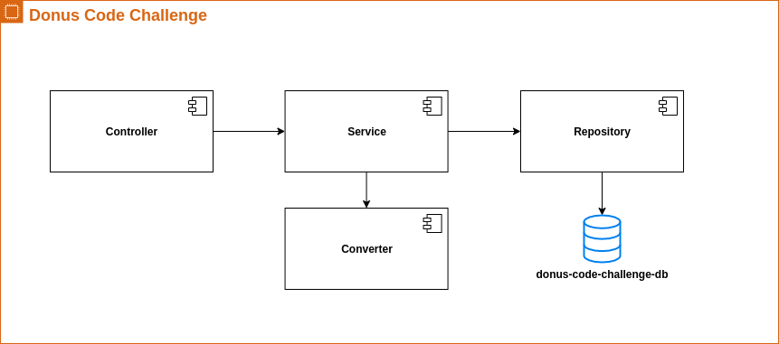

# Donus Code Challenge

[](https://travis-ci.org/github/isaiastavares/donus-code-challenge)
[](https://sonarcloud.io/dashboard?id=isaiastavares-github)
[](https://sonarcloud.io/dashboard?id=isaiastavares-github)
[](https://sonarcloud.io/dashboard?id=isaiastavares-github)
[](https://sonarcloud.io/dashboard?id=isaiastavares-github)
[](https://sonarcloud.io/dashboard?id=isaiastavares-github)
[](https://sonarcloud.io/dashboard?id=isaiastavares-github)
[](https://sonarcloud.io/dashboard?id=isaiastavares-github)
[](https://sonarcloud.io/dashboard?id=isaiastavares-github)
[](https://sonarcloud.io/dashboard?id=isaiastavares-github)

## Architecture
The project is built as follows:



## Requirements
* Java 11+
* Kotlin 1.3+
* Spring Boot 2.3+
* Docker (Engine and Compose)

## How to run the application locally

There are two ways to run the application. The first is using docker via command: 

```./start.sh```

The other way is to run the application separately via IDE or via maven command: 

```./mvnw spring-boot:run```

## Environments
| Environment | URL |
| ------------- | ------------- |
| Local | http://localhost:8089 |

## Swagger
The API documentation is available at: 

```${environmentUrl}/swagger-ui.html```